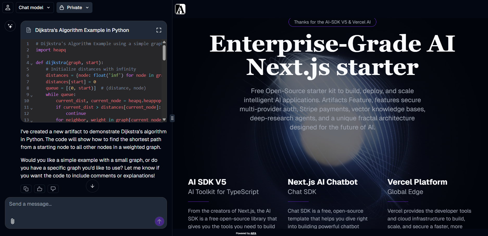

  

<h1 align="center">AIFA — Enterprise-Grade AI Next.js Starter</h1>

  
  
  

> Free Open-Source starter kit to build, deploy, and scale intelligent AI applications. Features secure multi-provider auth, Stripe payments, vector knowledge bases, deep-research agents, and a unique fractal architecture designed for the future of AI.

  
  <!-- Note: Make sure the image path is correct relative to your repository root -->

  

## 🚀 About The Project

**AIFA (AI Fractal Agents)** is more than just a starter kit; it's a foundation for building the next generation of intelligent, scalable AI applications. It provides a robust, enterprise-grade architecture using Next.js 15, designed for developers who want to move fast without sacrificing quality or scalability.

The core of this project is a multi-language SaaS platform featuring an AI chat, a powerful admin panel, and a public-facing website.

However, the long-term vision extends far beyond a traditional SaaS. AIFA is architected as the first step towards an ecosystem of decentralized AI agents. The goal is to create a platform where AI agents, initially trained by human experts, can evolve, replicate, and exchange knowledge on a blockchain network. This starter kit builds the critical infrastructure for that ambitious future.

## ✨ Core Features

This starter kit comes packed with features that are already implemented and ready to use:

- **Fractal UI Layout:** A sophisticated split-screen interface powered by Next.js Parallel Routes, featuring a persistent AI chatbot on the left and the main web application on the right for seamless user interaction.
- **AI Chatbot with Artifacts:** An intelligent chatbot that can generate "artifacts" — complex data, code, or documents — directly within the conversation.
- **Robust Authentication:** Secure, multi-provider authentication powered by `NextAuth.js`.
  - **80+ OAuth Providers:** Ready-to-use integration with Google, GitHub, and dozens of other services.
  - **Passwordless Login:** Secure email-based login via `Resend`.
  - **Role-Based Access Control (RBAC):** Pre-configured roles (Guest, Admin, Architect, Editor) with user-specific layouts and permissions.
- **Vector Knowledge Base Integration:** Connect to OpenAI's vector databases (or others) to provide context-aware, intelligent responses based on your private data. This can be configured per-user or per-model.
- **Unified Knowledge API:** A dedicated API endpoint for the chat and registration systems. This allows external tools like mobile apps or third-party websites to connect to the AIFA infrastructure, creating a single, unified knowledge base for any business.

## 🛠️ Technology Stack

AIFA is built on a modern, powerful, and scalable technology stack, leveraging the best of the JavaScript and AI ecosystems.

| Category           | Technologies                                                                                                                                                        |
| ------------------ | ------------------------------------------------------------------------------------------------------------------------------------------------------------------- |
| **Framework**      | [Next.js](https://nextjs.org/) 15, [React](https://react.dev/) 19                                                                                                   |
| **AI & SDKs**      | [Vercel AI SDK](https://sdk.vercel.ai/), [@ai-sdk/openai](https://www.npmjs.com/package/@ai-sdk/openai), [OpenAI](https://openai.com/)                              |
| **UI & UX**        | [shadcn/ui](https://ui.shadcn.com/), [Tailwind CSS](https://tailwindcss.com/), [Framer Motion](https://www.framer.com/motion/), [Lucide Icons](https://lucide.dev/) |
| **Database & ORM** | [Neon](https://neon.tech/) (Serverless Postgres), [Prisma](https://www.prisma.io/)                                                                                  |
| **Authentication** | [NextAuth.js](https://next-auth.js.org/) v5                                                                                                                         |
| **Infrastructure** | [Vercel](https://vercel.com/), [Upstash Redis](https://upstash.com/redis), [Vercel Blob](https://vercel.com/storage/blob)                                           |
| **Services**       | [Stripe](https://stripe.com/) (Payments), [Resend](https://resend.com/) (Emails)                                                                                    |
| **Tooling & Code** | [TypeScript](https://www.typescriptlang.org/), [Biome](https://biomejs.dev/) (Linter/Formatter), [Zod](https://zod.dev/)                                            |

## 🗺️ Roadmap

We are actively developing AIFA with a clear vision for the future.

- **✅ In Progress: AI-Powered Page Generation**

  - We are finalizing a feature inspired by `v0.dev` that allows users to generate beautifully designed pages, documents, and guides through conversational prompts. This will dramatically speed up content creation.

- **▶️ Up Next: Deep Chat & Content Synchronization**
  - The next major task is to create a seamless link between the AI chat and the application's content. This will enable workflows like:
    1.  A user starts a conversation with the chatbot.
    2.  The bot understands the intent and opens the relevant article or page in the right-hand panel.
    3.  The user highlights a specific piece of text on the page.
    4.  The chatbot automatically uses that highlighted text as new context to find and suggest other relevant materials from across the entire application, creating a powerful, dynamic research experience.

## 🏁 Getting Started

To get a local copy up and running, follow these simple steps.

### Prerequisites

Ensure you have [Node.js](https://nodejs.org/) (v18.x or newer) and [pnpm](https://pnpm.io/) installed.

## 📄 License

This project is distributed under the AGPL-3.0 license to ensure openness of all derivative works.

## 🏋️‍♀️ Author

Roma Armstrong
telegram contact: **@roma_armstrong**

---

_The future is not written in corporate data centers, but in code that lives and evolves on millions of servers around the world._
